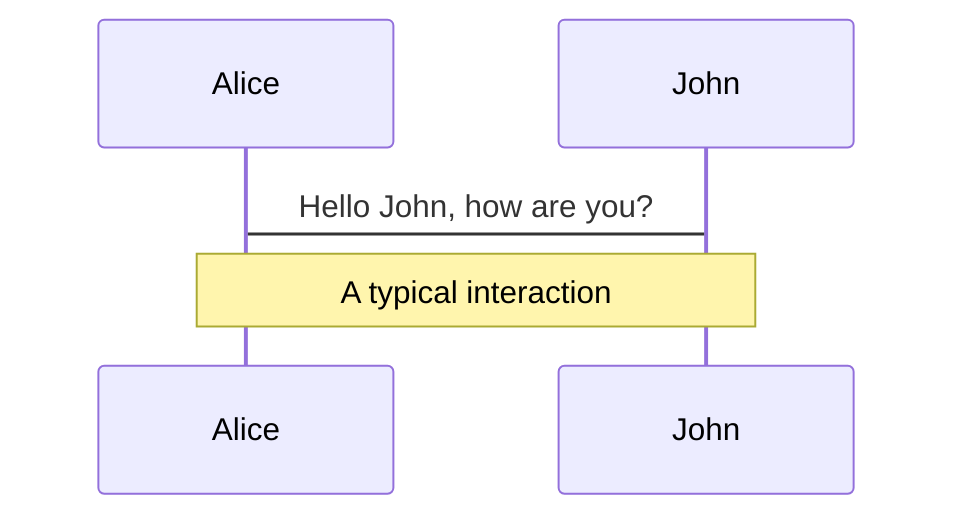
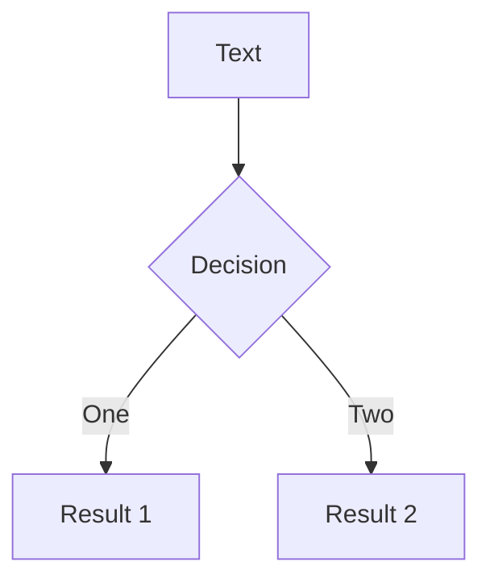

---
# try also 'default' to start simple
theme: seriph
# random image from a curated Unsplash collection by Anthony
# like them? see https://unsplash.com/collections/94734566/slidev
background: https://source.unsplash.com/collection/94734566/1920x1080
# apply any windi css classes to the current slide
class: 'text-center'
# https://sli.dev/custom/highlighters.html
highlighter: shiki
# some information about the slides, markdown enabled
info: |
  ## Slidev Starter Template
  Presentation slides for developers.

  Learn more at [Sli.dev](https://sli.dev)
---

# 自己紹介

## 成ヶ澤 秀

<div class="pt-12">
  <span @click="$slidev.nav.next" class="px-2 p-1 rounded cursor-pointer" hover="bg-white bg-opacity-10">
    Press Space for next page <carbon:arrow-right class="inline"/>
  </span>
</div>

<a href="https://github.com/slidevjs/slidev" target="_blank" alt="GitHub"
  class="abs-br m-6 text-xl icon-btn opacity-50 !border-none !hover:text-white">
<carbon-logo-github />
</a>

<!--
The last comment block of each slide will be treated as slide notes. It will be visible and editable in Presenter Mode along with the slide. [Read more in the docs](https://sli.dev/guide/syntax.html#notes)
-->

---

# 略歴

- 1991 年 10 月 7 日、北海道生まれ
- 2017 年, 北海道大学理学院数学専攻修士課程を修了
- 同年インタープリズム株式会社入社
- 現在に至る

<br>
<br>

<style>
h1 {
  background-color: #2B90B6;
  background-image: linear-gradient(45deg, #4EC5D4 10%, #146b8c 20%);
  background-size: 100%;
  -webkit-background-clip: text;
  -moz-background-clip: text;
  -webkit-text-fill-color: transparent;
  -moz-text-fill-color: transparent;
}
</style>

---

# どんなコードを書くのか?

業務以外にブラウザの拡張機能や Slack, discord の bot など同僚や同じ仕事をしている人に少し楽になるようなものを目指していくつかコードを書いてきました。

- レビュー依頼用 Slack アプリ
- 社内チャットでシンタックスハイライト表示ができるようになる chrome 拡張
- discord の voice channel で話した人を text channel に記録する bot

---

# レビュー依頼用 Slack アプリ

使っていたプロジェクト管理アプリケーションで複数プロジェクトをまたいで管理することがあまり向いておらず、レビュー依頼を Slack に集約。リンクを書いてお願いする運用。
しかし依頼が貯まると依頼されたものがわからなくなった。

<div grid="~ cols-2 gap-4">


<div>
任意のチャンネルでslash commandで左のイメージのようにモーダルが出現。

タイトル、内容、通知したい相手を選んで送る。

するとチャンネルに入力した内容でメッセージが送信され、メンションされるのでレビュアーはレビューされたことが認識出来ます。

</div>
</div>

---

# レビュー依頼用 Slack アプリ

<div grid="~ cols-2 gap-4">
<div>
appの画面からレビュー依頼したもの、されたものが表示され、されたものはOK、NGを出せる。

依頼したレビューに OK か NG かまだ見ていないという状態も同画面で確認でき、OK や NG が出されたときには同時に通知の DM がアプリからくる。

</div>
<video controls autoplay='true' muted='true' loop='true' width='600'>
    <source src="/public/slack_bot.mp4" type="video/mp4">
</video>
</div>

---

# 社内チャット用Chrome拡張

関連会社製のチャットツールが社内で使用されており業務のメッセージのやり取りにも使われている。<br/>
Slack等になれていると少し辛いが、チームで使用している人もいるのでちょっとでも便利に使えるようにシンタックスハイライトができるchrome拡張を作りました。

<div grid="~ cols-2 gap-2" m="-t-2">


<div>Before</div>
<div>After</div>


</div>


---

## preload: false

# Animations

Animations are powered by [@vueuse/motion](https://motion.vueuse.org/).

```html
<div v-motion :initial="{ x: -80 }" :enter="{ x: 0 }">Slidev</div>
```

<div class="w-60 relative mt-6">
  <div class="relative w-40 h-40">
    
    
    
  </div>

  <div
    class="text-5xl absolute top-14 left-40 text-[#2B90B6] -z-1"
    v-motion
    :initial="{ x: -80, opacity: 0}"
    :enter="{ x: 0, opacity: 1, transition: { delay: 2000, duration: 1000 } }">
    Slidev
  </div>
</div>

<!-- vue script setup scripts can be directly used in markdown, and will only affects current page -->
<script setup lang="ts">
const final = {
  x: 0,
  y: 0,
  rotate: 0,
  scale: 1,
  transition: {
    type: 'spring',
    damping: 10,
    stiffness: 20,
    mass: 2
  }
}
</script>

<div
  v-motion
  :initial="{ x:35, y: 40, opacity: 0}"
  :enter="{ y: 0, opacity: 1, transition: { delay: 3500 } }">

[Learn More](https://sli.dev/guide/animations.html#motion)

</div>

---

# LaTeX

LaTeX is supported out-of-box powered by [KaTeX](https://katex.org/).

<br>

Inline $\sqrt{3x-1}+(1+x)^2$

Block

$$
\begin{array}{c}

\nabla \times \vec{\mathbf{B}} -\, \frac1c\, \frac{\partial\vec{\mathbf{E}}}{\partial t} &
= \frac{4\pi}{c}\vec{\mathbf{j}}    \nabla \cdot \vec{\mathbf{E}} & = 4 \pi \rho \\

\nabla \times \vec{\mathbf{E}}\, +\, \frac1c\, \frac{\partial\vec{\mathbf{B}}}{\partial t} & = \vec{\mathbf{0}} \\

\nabla \cdot \vec{\mathbf{B}} & = 0

\end{array}
$$

<br>

[Learn more](https://sli.dev/guide/syntax#latex)

---

# Diagrams

You can create diagrams / graphs from textual descriptions, directly in your Markdown.

<div class="grid grid-cols-2 gap-4 pt-4 -mb-6">





</div>

[Learn More](https://sli.dev/guide/syntax.html#diagrams)

---

layout: center
class: text-center

---

# Learn More

[Documentations](https://sli.dev) / [GitHub Repo](https://github.com/slidevjs/slidev)
